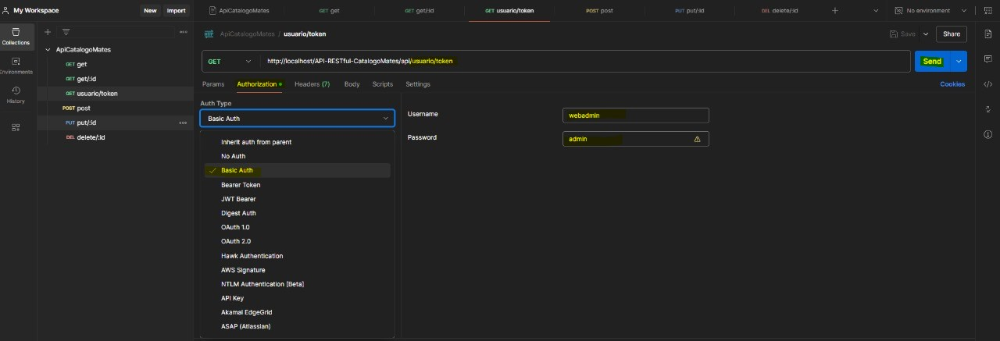
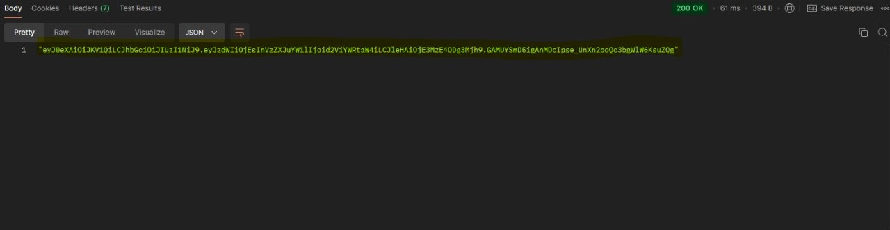

# TPE 2024 - Tercera parte

## Catalogo de Mates - API

---

### ENDPOINTS

| ACCION                                      | VERBO  | URL            |
| ------------------------------------------- | ------ | -------------- |
| Lista todos nuestros productos              | GET    | /producto      |
| Muestra un producto especifico segun su ID  | GET    | /producto/:ID  |
| Inserta un nuevo producto                   | POST   | /producto      |
| Modifica un producto especifico segun su ID | PUT    | /producto/:ID  |
| Elimina un producto especifico segun su ID  | DELETE | /producto/:ID  |
| Genera un token para la autenticacion       | GET    | /usuario/token |

---

## JWT (/usuario/token)

**Instrucciones para poder realizar las peticiones**

Para generar un token es necesario tener en cuenta los datos de la cuenta a utilizar.

- **Datos para la cuenta de administrador**

  **`Usuario`**: webadmin

**`Password`**: admin

## Utilizando **`Postman`**

**`1`** Primero escribimos la url a la que vamos a hacer la peticion, en este caso será

**http://localhost/API-RESTful-CatalogoMates/api/usuario/token**

**`2`** Nos dirigimos a la pestaña de **Authorization**.

**`3`** Seleccionar en el **Auth Type** el que se llama **Basic Auth** y luego rellenar los campos con los datos correspondientes, presionar **SEND** como se ve en la siguiente imagen para generar nuestro token:

El token generado se vera de la siguiente manera:

Este token deberemos utilizarlo en la seccion **Bearer token** colocandolo **SIN COMILLAS**, esto nos permitira utilizar las peticiones **POST**, **PUT** y **DELETE**.

Cabe aclarar que dicho token posee una duracion de 3600segundos (1 hora).

---

## ENDPOINTS EN PROFUNDIDAD

**Metodo GET**

Lista todos nuestros productos **`api/producto`**

Muestra un producto en especifico segun su id **`api/producto/:id`**

**Metodo POST**

Inserta un nuevo producto **`api/producto`**

**Metodo PUT**

Modifica un producto ya existente segun su id **`api/producto/:id`**

**Metodo DELETE**

Elimina un producto segun su id **`api/producto/:id`**

**Metodo GET (para autenticacion)**

Genera un token para la autenticacion **`api/usuario/token`**

Para ver mas informacion detallada con ejemplos de como usar los **`ENDPOINTS`** dirigirse a la siguiente dirección:

## **`https://documenter.getpostman.com/view/36457294/2sAYBPna8K#2c1f9412-050d-4937-a472-96da28c601f2`**

En esta pagina se ve de manera mas clara y con ejemplos las peticiones **`HTTP`** via **`Postman`**.

---

## EXTRAS

- Ordenamiento segun campo especifico

**`orderBy`**: podemos ordenar nuestros productos segun el campo que deseemos tanto de manera **ASCENDENTE(de manera default)** como **DESCENDENTE** de la siguiente manera.

http://localhost/API-RESTful-CatalogoMates/api/producto?orderBy=**Campo por el que queremos ordenar**

Podemos ordernar segun los siguientes campos:

**`id_mate`**

**`nombre_mate`**

**`forma_mate`**

**`recubrimiento_mate`**

**`color_mate`**

**`id_categoria_fk`**
(Las categorias disponibles son 1-> Calabaza, 2->Madera , 3->Vidrio)

Para ordenar de manera descendente deberemos respetar los campos anteriores con la diferencia que deberemos colocar un **`-`** antes de cada campo.

**`-id_mate`**

**`-nombre_mate`**

**`-forma_mate`**

**`-recubrimiento_mate`**

**`-color_mate`**

**`-id_categoria_fk`**
(Las categorias disponibles son 1-> Calabaza, 2->Madera , 3->Vidrio)

- Filtro segun campo especifico, en este caso **`forma_mate`**.

Para filtrar segun la **`forma_mate`** debemos armar la peticion GET de la siguiente manera, teniendo en cuenta que las formas de mate disponibles que tenemos son: **`Imperial`** **`Torpedo`** **`Camionero`**

**`Imperial`**

**http://localhost/API-RESTful-CatalogoMates/api/producto?forma_mate=imperial**

**`Torpedo`**

**http://localhost/API-RESTful-CatalogoMates/api/producto?forma_mate=torpedo**

**`Camionero`**

**http://localhost/API-RESTful-CatalogoMates/api/producto?forma_mate=camionero**

- Paginacion completa

Para paginar deberemos realizar la peticion de la siguiente forma haciendo uso del **`limit`** y **`page`**:

**http://localhost/API-RESTful-CatalogoMates/api/producto?limit=&page=**

Por ejemplo si queremos mostrar la informacion de los productos de la pagina 2 limitando la cantidad de productos a mostrar a 3 quedaria de la siguiente forma:

**http://localhost/API-RESTful-CatalogoMates/api/producto?limit=3&page=2**

Tambien podemos realizar la consulta colocando ademas del limit y el page un el filtro, por ejemplo:

**http://localhost/API-RESTful-CatalogoMates/api/producto?forma_mate=imperial&limit=3&page=2**
